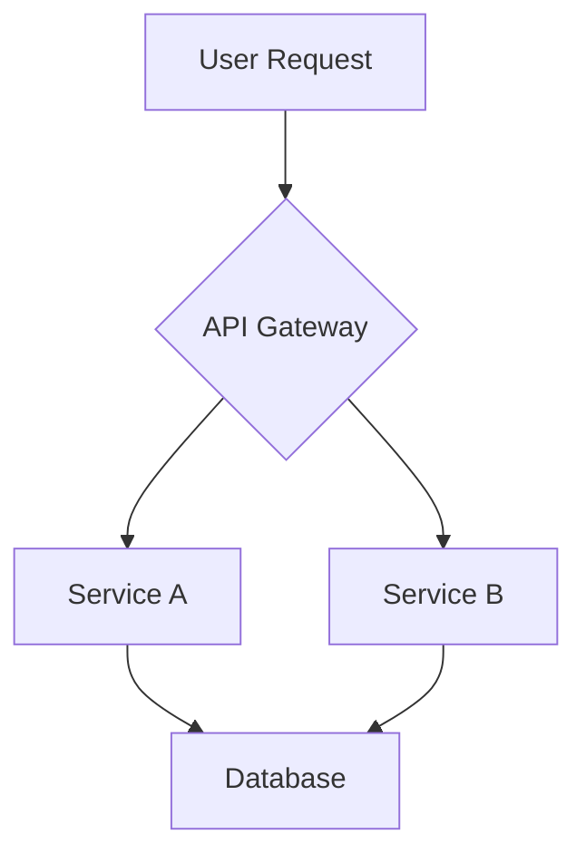

# Epic: [Feature Name]

## 1. Overview

**Goal:** A concise, one-sentence summary of the entire feature. What is the ultimate outcome?

**Why:** Explain the business or technical value. What problem does this solve? Why is it important now?

**Success Criteria:** High-level, measurable outcomes that define success for the entire epic.
- [ ] Metric 1 (e.g., End-to-end user workflow is possible)
- [ ] Metric 2 (e.g., Performance target met)
- [ ] Metric 3 (e.g., Deployed and verified in production)

---

## 2. Core Architecture & Design

Provide a high-level overview of the technical approach. Include diagrams, key design decisions, and descriptions of how the major components will interact. This section should provide enough context for someone to understand the "big picture" without needing to read every Sub-PRP.

*(Mermaid diagrams are encouraged here to visualize the architecture)*

---

## 3. Implementation Plan (Sub-PRPs)

This section lists all the Sub-PRPs required to complete the epic. The order represents the recommended implementation sequence.

| # | Title & Link | Status | Owner | Description |
|---|---|---|---|---|
| 1 | [Data Model & Storage](./sub-prps/01-data-model-and-storage.md) | `Pending` | `@username` | Defines the database schema and storage layer. |
| 2 | [API Endpoints](./sub-prps/02-api-endpoints.md) | `Pending` | `@username` | Implements the required API endpoints for the feature. |
| 3 | [Frontend Integration](./sub-prps/03-frontend-integration.md) | `Pending` | `@username` | Connects the frontend to the new API endpoints. |

---

## 4. Key Dependencies & Risks

- **Dependencies:** List any external dependencies (e.g., other teams, new infrastructure, third-party APIs).
- **Risks:** Identify potential risks (e.g., performance bottlenecks, security concerns, unknown technical challenges).